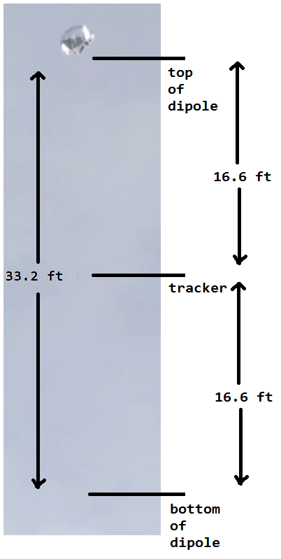

# Antenna

The dipole antenna must be fully deployed during flight for the transmitter to correctly function.

It is a half-wave 20 meter band antenna, so each leg of the dipole is 5 meters in size.