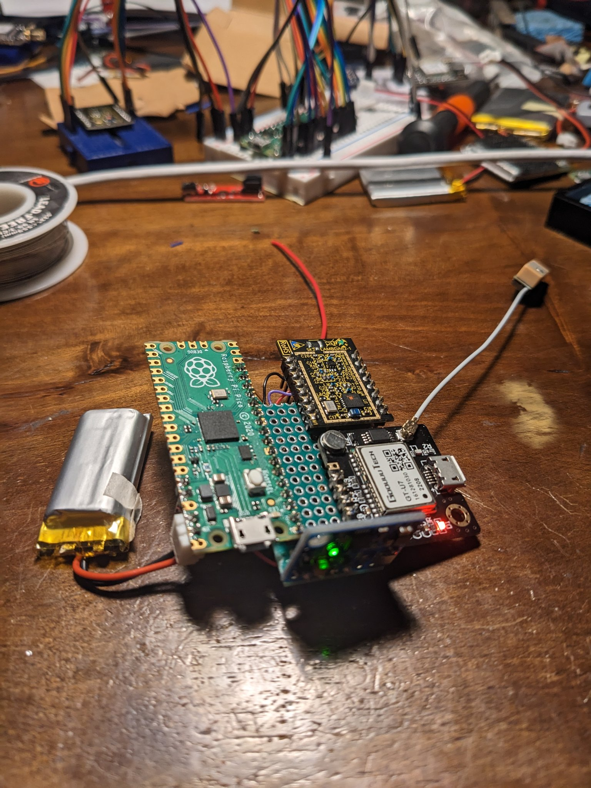

# TinyGlobo

A pico balloon floats into the great big world, towing a [Raspberry Pi RP2040 Pico](https://www.raspberrypi.com/products/raspberry-pi-pico/) programmed with [TinyGo](https://tinygo.org). 

This intrepid explorer reports data using LoRaWAN long-range radio over [The Things Network](https://www.thethingsnetwork.org/)

TinyGlobo 2 dashboard located here: https://cayenne.mydevices.com/shared/649c081073cdbf6039802640

## Previous flights

Check out the [flight](./flights.md) page for info about TinyGlobo 1.

## Flashing

```
make flash
```

## LoRaWAN credentials

Put your LoRaWAN keys into the `/keys` directory as explained in the README located there.


## Hardware



TinyGlobo 1 consists of:

- RP2040 Pico
- LAMBDA62 LoRa radio
- UBlox 6M GPS
- HW-290 multifunction I2C board
    - MPU6050
    - BMP180
    - HMC5883L

## Wiring

### GPS

| RP2040 Pin | GPS Pin |
|------------|---------|
| GP0 UART TX | RX |
| GP1 UART RX | TX |
| 3V3 | VCC |

### Sensors

| RP2040 Pin | HW-290 Pin |
|------------|---------|
| GP4 I2C0 SDA | SDA |
| GP5 I2C0 SCL | SCL |
| 3V3 | 3V3 |
| GND | GND |

### LAMBDA62 (SX1262)

| RP2040 Pin | LAMBDA62 Pin |
|------------|---------|
| GP6 | DIO1 |
| GP7 | DIO0 |
| GP8 | TX_SWITCH |
| GP9 | RX_SWITCH |
| GP10 | SCLK |
| GP11 SPI0 CDO | SDI |
| GP12 SPI0 CDI | SDO |
| GP13 SPI0 CS | nSEL |
| 3V3 | 3V3 |
| GND | GND |

## Samples

### GPS

tinygo flash -target pico ./verify/gps

