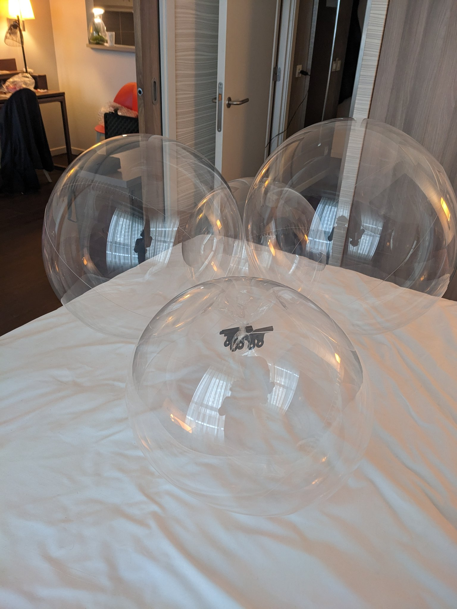

# Balloons

***NOTE: keep at least 1 clip attached to each balloon at all times!!!!***

You will need 4 - 36 inch transparent balloons. Cheap ones are fine, as long as you check for pinhole leaks while filling.

Use 2 big clips to hold them shut while filling to needed buoyancy.

## Calculate lift

Full payload of the TinyGlobo / 4 + 3g == Target lift per balloon

Clip weight minus (target lift per balloon / 4) == the weight to be shown on scale when filling balloons.

## Connecting balloons

Use 2 small tie wraps to seal each balloon, using a twist to the balloon neck to help keep sealed.

Connect 2 balloons together using small tie wraps. Now the other 2.

Then connect all 4 balloons together using 1 or 2 tie wraps.

Connect balloons to payload using fishing line, and another tie wrap. Make sure the knots are snug and correct.

FLY!!
