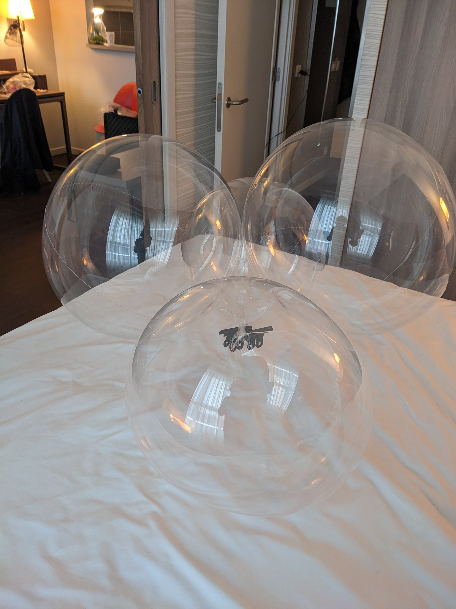

# Balloons

***NOTE: keep at least 1 clip attached to each balloon at all times!!!!***

You will need 4 - 36 inch transparent balloons. Cheap ones are fine, as long as you check for pinhole leaks while filling.

Use 2 big clips to hold them shut while filling to needed buoyancy.

## Stretching

The balloons need to be stretched by being completely filled approximately 24 hours before flight.

During assembly of the balloon cluster, some helium will be released from each balloon in order to achieve the target lift per balloon.

This will leave room for the helium to expand within each balloon during ascent without the balloon bursting.

## Calculate lift

Full payload weight of the TinyGlobo + 7 grams "free lift" is the total net lift needed.

Total net lift divided by 4 == net lift per balloon

Clip weight minus net lift per balloon == the weight to be shown on scale per balloon when filling with helium.

## Calibrate balloons

Now carefully release some helium from each balloon in order to achieve the net lift. Do not release too much at once or you run the risk of underfilling.

If the balloons are too full, they risk bursting when they reach higher altitudes.

If the balloons are not full enough, they might not provide enough lift to reach the higher altitudes needed.

## Connecting balloons

Use 2 small tie wraps to seal each balloon, using a twist to the balloon neck to help keep sealed.

Connect 2 balloons together using small tie wraps. Now the other 2.

Then connect all 4 balloons together using 1 or 2 tie wraps.

Connect balloons to payload using fishing line, and another tie wrap. Make sure the knots are snug and correct.

FLY!!
