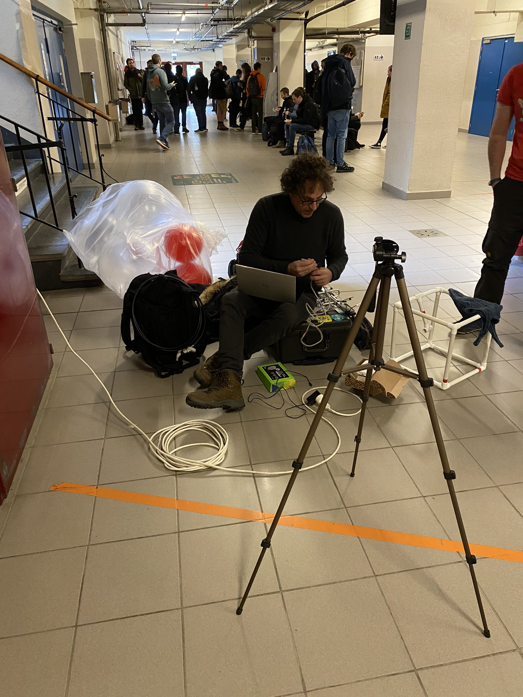

# TinyGlobo 1

Released in Brussels, Belgium on February 5, 2023 from Université Libre de Bruxelles, Solbach Campus during FOSDEM 2023 (https://fosdem.org/2023/).

## Dashboard

TinyGlobo 1 dashboard located here: https://cayenne.mydevices.com/shared/63da815d110400158f742f21

## Flight Data

|Stat|Data|
|----|----|
|Distance travelled before battery failure|400.64 Km|
|Time from release until battery failure|4:20:14 (H:M:S)|
|Highest recorded altitude|4843 M|
|Lowest recorded temperature|-18 C|
|Last recorded battery voltage|2.75 V|
|Payload weight|25.3 g|

## Images

